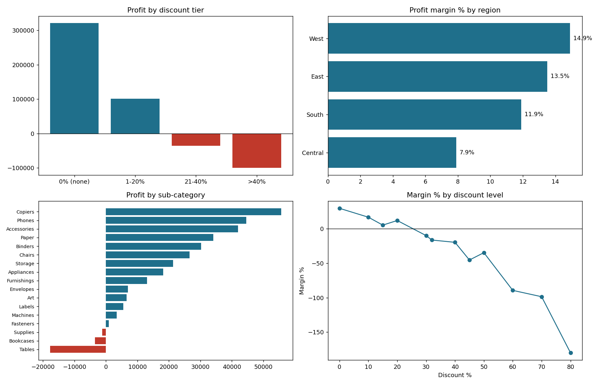

# Superstore Profitability Analysis: Where Do Discounts Destroy Profit?

**Business question:** Which discounts, categories and regions are losing money, and what should the business change?

**Tools:** Python (pandas, matplotlib), SQL (CTEs, window functions), Power BI (build guide included)
**Data:** Superstore sample dataset, 9,994 order lines, Jan 2014 to Dec 2017, US only.



## Key findings
| Finding | Evidence |
|---|---|
| **Heavy discounts cause the losses.** | Lines discounted above 20% are 13.9% of lines and 15.8% of sales, yet lose $135K. They account for 89% of all loss-making profit. |
| **Margin falls steadily as discounts rise.** | Correlation between discount and margin is -0.86. Margin is 29.5% with no discount, 11.9% at 1-20%, -15.3% at 21-40% and -77.4% above 40%. |
| **Furniture is the weak category.** | Furniture makes only a 2.5% margin on $742K sales versus 17% for Office Supplies and Technology. Tables (-$17.7K) and Bookcases (-$3.5K) lose money. |
| **Central region trails.** | Central has the lowest margin (7.9%) and the highest average discount (24.0%) against 10.9% in the West. |
| **Growth is real but held back.** | Profit grew every year from 2014 to 2017 ($49.5K to $93.4K), even though sales dipped in 2015. |

## Recommendations
1. **Cap discounts at 20% unless a manager approves.** In the same-volume case this lifts profit by about $219K (+77%). That is an upper bound, because it assumes customers still buy the same quantity.
2. **Floor case:** if every line discounted above 20% were simply lost, profit would still rise by $135K (+47%), because those lines lose money.
3. **Review Furniture pricing,** starting with Tables and Bookcases.
4. **Investigate discounting in the Central region and in Texas, Ohio, Pennsylvania and Illinois,** the four states with the largest losses.
5. **Track discount tier and loss-line share as standing KPIs** in the dashboard.

## Project structure
| Path | Description |
|---|---|
| `analysis.py` | Cleans data, builds summary tables, discount scenarios and charts |
| `sql/profitability_queries.sql` | 7 business queries: KPIs, tiers, region matrix, loss share, YoY window function |
| `sql/run_sql.py` | Runs the queries on SQLite to check results match pandas |
| `dashboard/index.html` | Interactive web dashboard (filters, KPIs, drill by click) |
| `powerbi/build_guide.md` | Data model, DAX measures, page layouts and drill-down steps |
| `data/` | Raw sample file and cleaned CSV with parsed dates and a discount tier column |
| `outputs/` | Summary tables, scenario table and chart |

## Run it
```bash
pip install -r requirements.txt
python analysis.py        # writes data/superstore_clean.csv and outputs/
python sql/run_sql.py     # prints all SQL query results
```

## Method notes
- Discount tiers: none, 1-20%, 21-40%, above 40%.
- Scenario A rebuilds list price as Sales / (1 - Discount), re-applies a 20% cap and keeps cost and volume constant.
- Scenario B drops all lines discounted above 20%.
- The dataset has no "market" field, so geography is analysed by Region and State.

## Interactive dashboard
`dashboard/index.html` is a self-contained web dashboard (no install needed). Open it in a browser, or turn on **GitHub Pages** (Settings > Pages > Deploy from branch > `main` / root) and it will be live at `https://<your-username>.github.io/superstore-profitability/dashboard/`. Filters for region, category and year update the KPIs and charts, and clicking a region, year or sub-category filters the view.

## Power BI version
`powerbi/build_guide.md` and `powerbi/measures.dax` contain the data model, DAX measures and page layouts to rebuild this in Power BI Desktop. Add a screenshot here once built: ``
                                                                                                             
                                                                                                             
